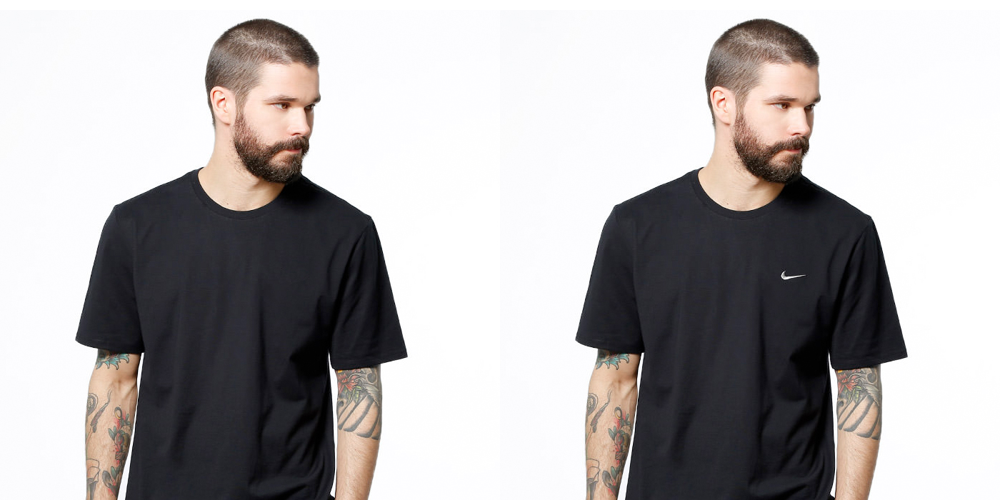
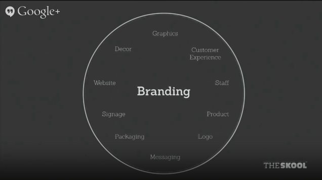

## Branding 101
Before we start doing the sprints, I think we first need to establish what it is that we're trying to do here. Like a crash course in branding! So, what exactly is branding?

### Branding Mythology
Okay, let's do an activity. Select the items from the list below which you think is branding:

- Branding is the Logo (Insignia, Symbol, Icon, ect.)
- Branding is an Identity (Brandbooks, Styleguides)
- Branding is the Actual Product

If you answered yes to all of the above, congratulations! - It's incorrect! Confused? Don't worry, I was also there before.

### What is a Brand?
> "A brand is a person's gut feeling about a product, service or company. You can't control the process, but you can surely influence it." 
_- The Brand Gap, Marty Neumeier_

That's it. But why? It makes sense because what others feel about your product or service is defined by people, and not what the market or advertising agencies say. 

So It's not what *you* say it is. It's what *they* say it is"

### But why is it important?

While there's so many way to go about this, here's an example:

On the left is a normal black shirt that probably would cost around Php250. Now add that swoosh logo from Nike, you could price it for a thousand more. And that ladies & gentleman, is the power of branding.

### So, where does that put us into?
Basically what we're doing is actually just a part of the whole branding strategy. We're basically laying down the foundation of developing the brand in an attempt to create what their company or product visually represent.

Our mission as designers is to transform their ideas and vision into something tangible and cohesize - a visual representation of the values of their company.

### So, we're doing a logo right?
"The term *Logo*, short for Logotype, design-speak for a *trademark* made from a custom-lettered word (Logos is Greek for Word)"

Therefore,

>" A trademark can be a logo, symbol, monogram, emblem or other graphic dvice. *A trademark is not the brand itself. It's merely a symbol for it.*"
_- The Futur, Chris Do_

